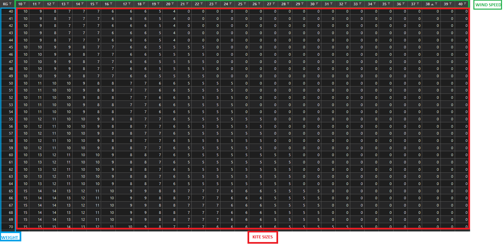
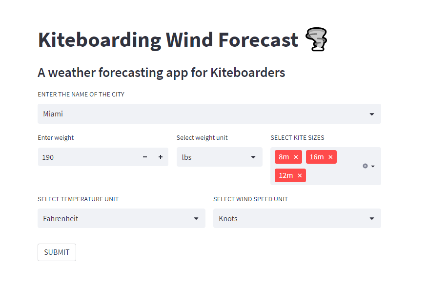
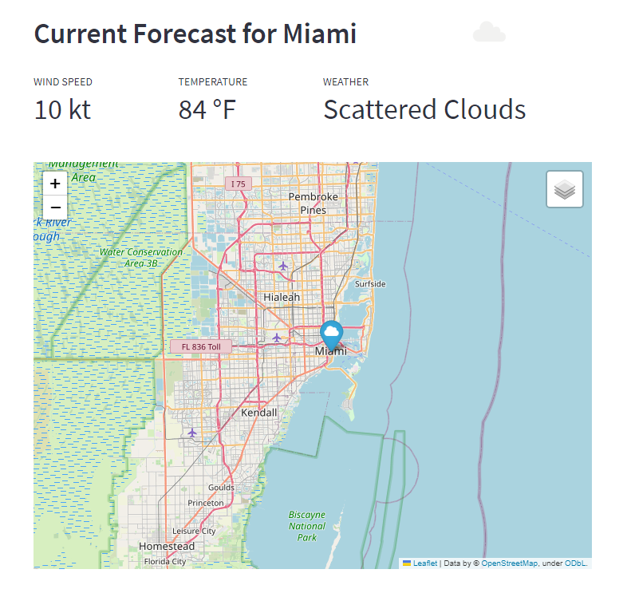
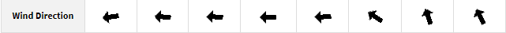
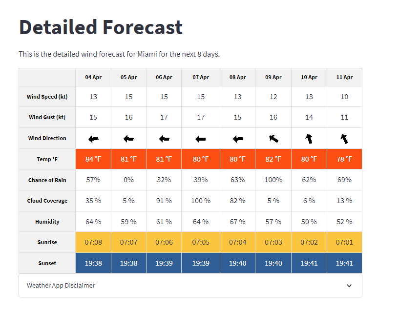
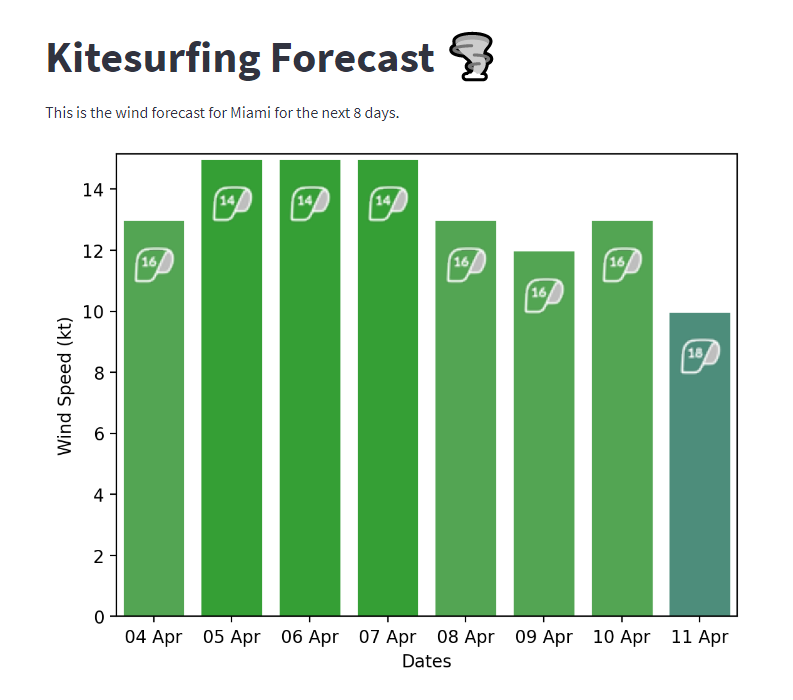
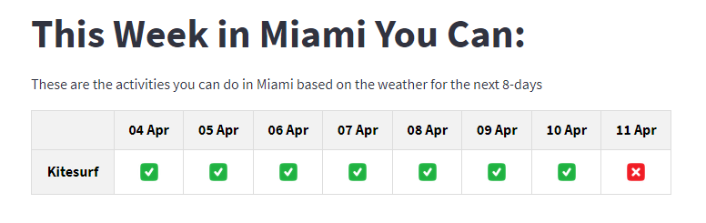
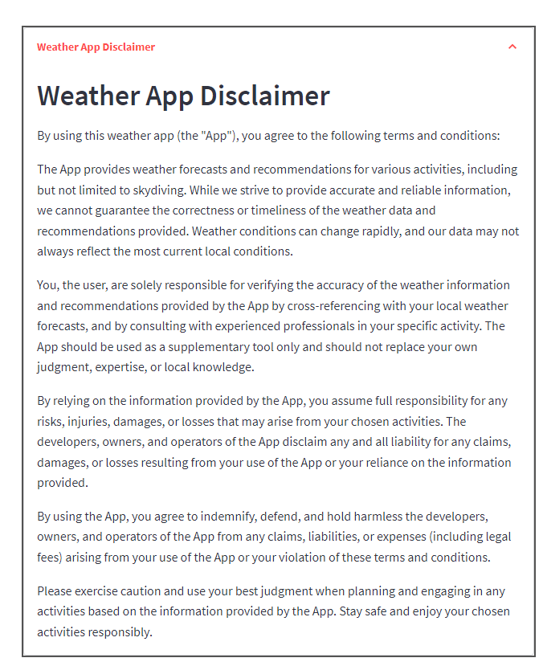

# Project 3: Kiteboarding Weather Predictor 🏄🌪️

### Live App Link: [link](https://marcleipold-project-3-weather-predictor-weather-8oszs3.streamlit.app/)
### Presentation Deck: [link](https://docs.google.com/presentation/d/1CDhO2KZgJhaKbrxrh_fUmVAF2Ntfik1SgVeoMUuZgQs/edit?usp=sharing)

Welcome to the Kiteboarding Weather Predictor repository! This project aims to provide a comprehensive and interactive weather forecasting application specifically designed for kiteboarders. With the help of various Python libraries and APIs, we have built a user-friendly tool that allows kiteboarders to determine the best times to ride based on their weight, the wind speed, and the kite sizes they own.

The application fetches real-time weather data from OpenWeatherMap API and historical weather data from various sources. It leverages machine learning algorithms to predict future weather trends and displays this information using interactive charts and maps. Users can enter a location of their choice, and the application will present them with detailed weather forecasts, as well as insights on historical trends and patterns, tailored for kiteboarding sessions.

## Key Features

- Real-time weather data retrieval from OpenWeatherMap API
- 8-Day kiteboarding weather data visualization
- Interactive charts and maps for better user experience
- Customizable location input
- Easy-to-use web interface powered by Streamlit
- Tailored weather forecasts for kiteboarders based on their weight, wind speed, and kite sizes

Whether you're a kiteboarding enthusiast, a traveler looking for accurate weather forecasts for your next ride, or someone interested in exploring the patterns of our planet's climate, this Kiteboarding Weather Predictor application is designed for you. Dive in and explore the world of weather forecasting with us, and make the most of your kiteboarding sessions!

Feel free to check the repository, contribute, or provide suggestions to improve the application. For more information on setting up and running the project, please refer to the sections below.

[](https://www.python.org/)
[](<LINK>)
[](<LINK>)


## Dependencies

The following Python packages are required to run this project:

- `numpy` https://numpy.org/doc/
- `streamlit` https://docs.streamlit.io/
- `datetime` https://docs.python.org/3/library/datetime.html
- `requests` https://docs.python-requests.org/en/master/
- `plotly.graph_objects` https://plotly.com/python/graph-objects/
- `PIL.Image` https://pillow.readthedocs.io/en/stable/
- `pandas` https://pandas.pydata.org/pandas-docs/stable/
- `matplotlib.pyplot` https://matplotlib.org/stable/contents.html
- `matplotlib.offsetbox.OffsetImage` https://matplotlib.org/stable/api/offsetbox_api.html
- `matplotlib.offsetbox.AnnotationBbox` https://matplotlib.org/stable/api/offsetbox_api.html
- `matplotlib.colors.LinearSegmentedColormap` https://matplotlib.org/stable/api/colors_api.html
- `matplotlib` https://matplotlib.org/stable/contents.html
- `matplotlib.cm` https://matplotlib.org/stable/tutorials/colors/colormaps.html
- `colorspacious.cspace_converter` https://colorspacious.readthedocs.io/en/latest/
- `io.BytesIO` https://docs.python.org/3/library/io.html
- `pytz` https://pythonhosted.org/pytz/
- `folium` https://python-visualization.github.io/folium/
- `folium.plugins.MarkerCluster` https://python-visualization.github.io/folium/plugins.html
- `streamlit_folium.folium_static` https://github.com/randyzwitch/streamlit-folium
- `IPython.display` https://ipython.org/ipython-doc/3/api/generated/IPython.display.html
- `os` https://docs.python.org/3/library/os.html
- `dotenv.load_dotenv` https://github.com/theskumar/python-dotenv
- `gzip` https://docs.python.org/3/library/gzip.html
- `json` https://docs.python.org/3/library/json.html


### Import Dependencies
```
import numpy as np
import streamlit as st
import datetime,requests
from plotly import graph_objects as go
from PIL import Image
import pandas as pd
import matplotlib.pyplot as plt
from matplotlib.offsetbox import OffsetImage, AnnotationBbox
from matplotlib.colors import LinearSegmentedColormap
import matplotlib as mpl
from matplotlib import cm
from colorspacious import cspace_converter
from io import BytesIO
import requests
import base64
import io
import pytz
import folium
from folium.plugins import MarkerCluster
from streamlit_folium import folium_static
import IPython.display
import os
from dotenv import load_dotenv
import gzip
import json
import os
```
### Load in variables dataframes and datasets
```
# Load the variables from the .env file
load_dotenv()

# Access Keys & Credentials
owm_api = os.environ['OPENWEATHERMAP_API_KEY']
google_api = os.environ['GOOGLE_MAPS_API_KEY']

# load in the wind chart and create a dataframe
wind_chart = pd.read_csv("wind_chart_df.csv", index_col=[0])
wind_chart_df = pd.DataFrame(wind_chart)
wind_chart_df.columns = wind_chart_df.columns.astype("int64")

# Get the absolute path to city.list.json.gz based on the location of app.py
current_dir = os.path.dirname(os.path.realpath(__file__))
city_list_file = os.path.join(current_dir, "city.list.json.gz")

with gzip.open(city_list_file, "rt", encoding="utf-8") as f:
    city_data = json.load(f)
    

# Assuming the city dictionaries have a 'name' key for city names
city_names = [city['name'] for city in city_data]
```




### User inputs for the app
```
# User input for city name
city = st.selectbox("ENTER THE NAME OF THE CITY ", (city_names), index=19303)

# Create two columns for user input
col1, col2 = st.columns([2, 1])
with col1:
    # User input for weight and weight unit
    w, wu = st.columns([3, 2])
    with w:
        weight_val = st.number_input("Enter weight", min_value=0, max_value=300, key=None)
    with wu:
        weight_unit_val = st.selectbox("Select weight unit", ["kg", "lbs"])
with col2:
    # User input for kite sizes
    kite_sizes = ["3m", "4m", "5m", "6m", "7m", "8m", "9m", "10m", "11m", "12m", "13m", "14m", "15m", "16m", "17m", "18m", "19m"]
    selected_kite_sizes = st.multiselect("SELECT KITE SIZES", kite_sizes)

    # Convert the selected kite sizes to integers (removing the 'm' character)
    selected_kite_sizes_int = [int(size[:-1]) for size in selected_kite_sizes]

# Create two columns for user input
col1, col2 = st.columns(2)
with col1:
    # User input for temperature unit
    unit = st.selectbox("SELECT TEMPERATURE UNIT ", ["Celsius", "Fahrenheit"])
with col2:
    # User input for wind speed unit
    speed = st.selectbox("SELECT WIND SPEED UNIT ", ["Knots", "Kilometers/hour", "Miles/hour"])
    
```


### Set the unit labels for weight, temperature, and wind speed
```
if weight_unit_val == "kg":
    weight_unit = " kg"
else:
    weight_unit = " lbs"

if unit == "Celsius":
    temp_unit = " °C"
else:
    temp_unit = " °F"

if speed == "Kilometers/hour":
    wind_unit = " km/h"
elif speed == "Knots":
    wind_unit = " kt"
elif speed == "Miles/hour":
    wind_unit = " mi/h"
else:
    wind_unit = " m/s"
    
# Check if the selected weight_unit_val is 'lbs'
if weight_unit_val == "lbs":
    # Convert the weight_val to kg (1 lb = 0.453592 kg)
    weight_val = round(weight_val * 0.453592)
```

### Request weather data from OpenWeatherMap API for the selected city

```
url = f"https://api.openweathermap.org/data/2.5/weather?q={city}&appid={owm_api}"
response = requests.get(url)
x = response.json()
    
# When the user clicks the submit button
if st.button("SUBMIT"):
    try:
        # Extract longitude and latitude from the weather data
        lon = x["coord"]["lon"]
        lat = x["coord"]["lat"]

        # Set the excluded data types for the One Call API request
        ex = "current,minutely,hourly"
        url2 = f'https://api.openweathermap.org/data/2.5/onecall?lat={lat}&lon={lon}&exclude={ex}&appid={owm_api}'
        
        # Request weather data for the specified location
        res = requests.get(url2)
        y = res.json()

        # Get the timezone offset in seconds
        timezone_offset = y["timezone_offset"]

        # Initialize lists to store the weather data
        maxtemp = []
        mintemp = []
        maintemp = []
        pres = []
        humd = []
        wspeed = []
        wgust = []
        wind_deg = []
        desc = []
        cloud = []
        rain = []
        dates = []
        sunrise = []
        sunset = []

        # Conversion factor for Kelvin to Celsius
        cel = 273.15

        # Process the daily weather data
        for item in y["daily"]:
            # Convert temperatures to the selected unit and add to the corresponding lists
            if unit == "Celsius":
                maxtemp.append(round(item["temp"]["max"] - cel))
                mintemp.append(round(item["temp"]["min"] - cel))
                temp = str(round(x["main"]["temp"] - cel, 2))
                maintemp.append(round((((x["main"]["temp"] - cel) * 1.8) + 32)))
            else:
                maxtemp.append(round((((item["temp"]["max"] - cel) * 1.8) + 32)))
                mintemp.append(round((((item["temp"]["min"] - cel) * 1.8) + 32)))
                temp = str(round((((x["main"]["temp"] - cel) * 1.8) + 32), 2))
                maintemp.append(str(round((((x["main"]["temp"] - cel) * 1.8) + 32))))

            # Convert wind speed and gust to the selected unit and add to the corresponding lists
            if wind_unit == " m/s":
                wspeed.append(str(round(item["wind_speed"] * 1)))
                wgust.append(str(round(item["wind_gust"] * 1)))
            elif wind_unit == " kt":
                wspeed.append(str(round(item["wind_speed"] * 1.94384)))
                wgust.append(str(round(item["wind_gust"] * 1.94384)))
            elif wind_unit == " mi/h":
                wspeed.append(str(round(item["wind_speed"] * 2.23694)))
                wgust.append(str(round(item["wind_gust"] * 2.23694)))
            else:
                wspeed.append(str(round(item["wind_speed"] * 3.6)))
                wgust.append(str(round(item["wind_gust"] * 3.6)))

            # Add other weather data to the corresponding lists
            pres.append(item["pressure"])
            humd.append(str(item["humidity"]) + ' %')
            wind_deg.append(round((item["wind_deg"])))
            cloud.append(str(item["clouds"]) + ' %')
            rain.append(str(int(item["pop"] * 100)) + '%')
            desc.append(item["weather"][0]["description"].title())

            # Convert the Unix timestamp to a date object and format the date
            d1 = datetime.date.fromtimestamp(item["dt"])
            dates.append(d1.strftime('%d %b'))

            # Convert the timezone offset to minutes and create a timezone object
            local_timezone = pytz.FixedOffset(timezone_offset // 60)

            # Convert the sunrise and sunset times to the local timezone and format them
            sunrise_time = datetime.datetime.utcfromtimestamp(item["sunrise"]).replace(tzinfo=pytz.utc).astimezone(local_timezone)
            sunset_time = datetime.datetime.utcfromtimestamp(item["sunset"]).replace(tzinfo=pytz.utc).astimezone(local_timezone)
            sunrise.append(sunrise_time.strftime('%H:%M'))
            sunset.append(sunset_time.strftime('%H:%M'))
```

### Create a GoogleMaps map for the weather station
```
# Calculate the bounding box of the displayed area
        delta_lat = 1.5  # You can adjust this value to change the size of the bounding box
        delta_lon = 1.5  # You can adjust this value to change the size of the bounding box
        southwest_lat = lat - delta_lat / 2
        southwest_lon = lon - delta_lon / 2
        northeast_lat = lat + delta_lat / 2
        northeast_lon = lon + delta_lon / 2

        # Function to fetch weather data for a given city
        def fetch_weather_data(city):
            url = f"https://api.openweathermap.org/data/2.5/weather?q={city}&appid={owm_api}"
            response = requests.get(url)
            return response.json()

        # Fetch the weather data for the specified city
        weather_data = fetch_weather_data(city)
        lon = weather_data["coord"]["lon"]
        lat = weather_data["coord"]["lat"]

        # Set the center of the map to the specified location
        center_lat = lat
        center_lon = lon

        # Create the map with the specified center and zoom level
        map = folium.Map(location=[center_lat, center_lon], zoom_start=10)

        # Add a marker cluster to the map
        marker_cluster = MarkerCluster().add_to(map)
        
        # Add markers to the map based on the OpenWeatherMap data
        locations = [
            (lat, lon),
        ]

        for lat, lon in locations:
            weather_info = f"{weather_data['name']} - {weather_data['weather'][0]['description']}"
            folium.Marker(
                location=[lat, lon],
                popup=weather_info,
                icon=folium.Icon(icon="cloud", prefix="fa"),
            ).add_to(marker_cluster)

        # Add OpenWeatherMap Wind Layer as an ImageOverlay
        overlay_url = f"https://tile.openweathermap.org/map/overlay/wind/{{z}}/{{x}}/{{y}}.png?appid={owm_api}&op=WND&use_norm=false&arrow_step=32"

        folium.raster_layers.ImageOverlay(
            image=overlay_url,
            bounds=[[southwest_lat, southwest_lon], [northeast_lat, northeast_lon]],
            attr="&copy; <a href=https://openweathermap.org>OpenWeatherMap</a>",
            name="Wind",
            #opacity=0.7,  # Set the opacity of the layer
        ).add_to(map)

        folium.LayerControl().add_to(map)
```



### Function to rotate the arrow image based on the wind direction  
```
 # Function to rotate the arrow image based on the wind direction  
        def arrow_rotate_image(image, wind_directions):
            image_array = np.array(image)
            height, width = image_array.shape[:2]
            center_x = width // 2
            center_y = height // 2

            mean_wind_direction = np.mean(wind_directions)
            angle_radians = np.radians(mean_wind_direction)
            cos_theta = np.cos(angle_radians)
            sin_theta = np.sin(angle_radians)
            rotation_matrix = np.array([
                [cos_theta, -sin_theta],
                [sin_theta, cos_theta]
            ])

            rotated_image_array = np.zeros_like(image_array)
            for y in range(height):
                for x in range(width):
                    relative_x = x - center_x
                    relative_y = y - center_y
                    new_x, new_y = np.matmul(rotation_matrix, [relative_x, relative_y])
                    new_x += center_x
                    new_y += center_y

                    if 0 <= new_x < width and 0 <= new_y < height:
                        rotated_image_array[y, x] = image_array[int(new_y), int(new_x)]

            return Image.fromarray(rotated_image_array)
        
        # Function to convert an image to a base64 encoded string
        def convert_image_to_base64(image):
            buffered = BytesIO()
            image.save(buffered, format="PNG")
            img_str = base64.b64encode(buffered.getvalue()).decode("utf-8")
            return img_str
```



### Function to create the wind forecast HTML table
```
 # Function to create the wind forecast HTML table
        def wind_forecast_html_table(dates, images, wspeed, wgust, maxtemp, rain, cloud, humd, sunrise, sunset):
            # Define the table's CSS styles
            table_html = '''
            <style>
            .forecast-table {
                border-collapse: collapse;
                width: 100%;
            }
            .forecast-table th,
            .forecast-table td {
                border: 1px solid #ddd;
                padding: 8px;
                text-align: center;
            }
            .forecast-table th {
                background-color: #f2f2f2;
                color: black;
                font-size: 12px;
                max-width: 85px;
            }
            
            table.forecast-table tr.temperature-row td {
                background: #fd4200eb;
                color: #fff;
            }
            
            table.forecast-table tr.temperature-row td {
                background: #fd4200eb;
                color: #fff;
            }
            
            table.forecast-table tr.sunrise-row td {
                background: #fbc540;
            }
            
            table.forecast-table tr.sunset-row td {
                background: #16498ae3;
                color: white;
            }       
            
            </style>
            '''
            
            # Start the table with an empty header cell
            table_html += '<table class="forecast-table"><thead><tr><th></th>'
            
            # Add date headers
            for date in dates:
                table_html += f'<th>{date}</th>'
            table_html += '</tr></thead><tbody>'

            # Add wind speed row
            table_html += f'<tr class="wind-speed-row"><th>Wind Speed ({trimmed_wind_unit})</th>'
            for speed in wspeed:
                table_html += f'<td>{speed}</td>'
            table_html += '</tr>'

            # Add wind gust row
            table_html += f'<tr class="wind-gust-row"><th>Wind Gust ({trimmed_wind_unit})</th>'
            for gust in wgust:
                table_html += f'<td>{gust}</td>'
            table_html += '</tr>'

            # Add wind direction row
            table_html += f'<tr class="wind-direction-row"><th>Wind Direction</th>'
            for image in images:
                table_html += f'<td></td>'
            table_html += '</tr>'

            # Add temperature row
            table_html += f'<tr class="temperature-row"><th>Temp {temp_unit}</th>'
            for temperature in maxtemp:
                table_html += f'<td>{temperature}{temp_unit}</td>'
            table_html += '</tr>'

            # Add rain row
            table_html += f'<tr class="rain-row"><th>Chance of Rain</th>'
            for rainn in rain:
                table_html += f'<td>{rainn}</td>'
            table_html += '</tr>'

            # Add clouds row
            table_html += f'<tr class="cloud-row"><th>Cloud Coverage</th>'
            for cloudd in cloud:
                table_html += f'<td>{cloudd}</td>'
            table_html += '</tr>'

            # Add humidity row
            table_html += f'<tr class="humidity-row"><th>Humidity</th>'
            for humidity in humd:
                table_html += f'<td>{humidity}</td>'
            table_html += '</tr>'

            # Add sunrise row
            table_html += f'<tr class="sunrise-row"><th>Sunrise</th>'
            for sun_r in sunrise:
                table_html += f'<td>{sun_r}</td>'
            table_html += '</tr>'

            # Add sunset row
            table_html += f'<tr class="sunset-row"><th>Sunset</th>'
            for sun_s in sunset:
                table_html += f'<td>{sun_s}</td>'
            table_html += '</tr>'

            table_html += '</tbody></table>'

            return table_html
        
        # Set the path to the arrow image file and open the image
        arrow_image_path = 'images/arrow.png'
        arrow_image = Image.open(arrow_image_path)

        # Resize the arrow image
        resized_arrow_image = arrow_image.resize((24, 24), Image.ANTIALIAS)

        # Initialize an empty list to store base64-encoded arrow images
        arrow_images_base64 = []

        # Loop through wind directions, rotate arrow images, and store them as base64 strings
        for wind_direction in wind_deg:
            rotated_arrow_image = arrow_rotate_image(resized_arrow_image, [wind_direction])
            rotated_image_base64 = convert_image_to_base64(rotated_arrow_image)
            arrow_images_base64.append(rotated_image_base64)

        # Generate the HTML table with the wind forecast data
        wind_html_table = wind_forecast_html_table(dates, arrow_images_base64, wspeed, wgust, maxtemp, rain, cloud, humd, sunrise, sunset)
```



###
```
 # Function to get the kite size from the kite_wind_chart
        def get_cell_value(weight_val, wspeed, dataframe):
            # Ensure weight and wind_speed are within the DataFrame's bounds
            if weight_val in dataframe.index and int(wspeed) in dataframe.columns:
                return dataframe.loc[weight_val, wspeed]
            else:
                return -1  # Return -1 when the weight and wind speed are not found in the DataFrame

        # Get kite size values based on the weight and wind speed
        kite_values = [get_cell_value(weight_val, int(float(w)), wind_chart_df) for w in wspeed]

        # Convert each element in the list to an int if it's not -1
        kite_values_int = [int(value) if value != -1 else -1 for value in kite_values]
```
### Wind Speed Bar Graph with Kite Size

```
# Fig3 bar graph with wind speed kite img
        def bargraph_wind3(dates, wspeed, kite_img_path, kite_img_size):
            # Create a bar chart
            fig3, ax = plt.subplots()
            bars = ax.bar(dates, wspeed, edgecolor='white', linewidth=1)

            # Set axis labels and title
            ax.set_xlabel("Dates")
            ax.set_ylabel(f"Wind Speed ({trimmed_wind_unit})")

            # Assign colors based on the arrow wind speed scale
            for i, (rect, w) in enumerate(zip(bars, wspeed)):
                # Set the bar color based on wind speed
                if w <= 1:
                    color = '#6286B7'
                elif w <= 2:
                    color = '#39619F'
                elif w <= 6:
                    color = '#4A94A9'
                elif w <= 10:
                    color = '#4D8D7B'
                elif w <= 14:
                    color = '#53A553'
                elif w <= 17:
                    color = '#359F35'
                elif w <= 21:
                    color = '#A79D51'
                elif w <= 25:
                    color = '#9F7F3A'
                elif w <= 29:
                    color = '#A16C5C'
                elif w <= 33:
                    color = '#813A4E'
                elif w <= 37:
                    color = '#AF5088'
                elif w <= 41:
                    color = '#754A93'
                elif w <= 47:
                    color = '#6D61A3'
                elif w <= 52:
                    color = '#44698D'
                elif w <= 56:
                    color = '#5C9098'
                else:
                    color = '#7D44A5'  
                rect.set_facecolor(color)
            
            # Add kite size images to the bars based on kite_values
            for rect, w in zip(ax.patches, kite_values):
                # Load the kite image from a URL
                url = f'https://extrevity.com/wp-content/uploads/2021/11/{w}Artboard-1@2x.png'
                response = requests.get(url)

                # Check if the response content type is an image
                if response.headers['Content-Type'].startswith('image/'):
                    kite_img = Image.open(BytesIO(response.content))

                    # Create an offset image object
                    kite_img.thumbnail(kite_img_size)
                    offset_img = OffsetImage(kite_img, zoom=1.0)
                    offset_img.image.axes = ax

                    # Add the kite size to the bar
                    x_pos = rect.get_x() + rect.get_width() / 2.0
                    y_pos = rect.get_y() + rect.get_height() - 1.5
                    ab = AnnotationBbox(offset_img, (x_pos, y_pos), xycoords='data', frameon=False)
                    ax.add_artist(ab)
                else:
                    print(f"Error: URL {url} did not return an image. Content-Type: {response.headers['Content-Type']}")
                
            
            # Adjust layout
            ax.margins(x=0.01, y=0.01)  # Adjust margins

            # Set the spacing between bars
            bar_width = 10
            ax.set_xticks(np.arange(len(dates)))
            ax.set_xticklabels(dates)

            # Set the font color
            for label in ax.get_xticklabels() + ax.get_yticklabels():
                label.set_color("black")

            # Return the figure
            return fig3
```




### Activities Table - Can you do x Activity this week?
```

        # Load the true and false images
        true_image = Image.open('images/icons8-checked-checkbox-64.png')
        false_image = Image.open('images/icons8-close-window-64.png')

        # Function to convert an image to base64 format
        def image_to_base64(image):
            buffered = BytesIO()
            image.save(buffered, format="PNG")
            return base64.b64encode(buffered.getvalue()).decode()

        # Function to resize an image
        def resize_image(image, width, height):
            return image.resize((width, height), Image.ANTIALIAS)

        # Create a list to store the result of whether kitesurfing is possible
        result = []

        # Check if kitesurfing is possible for each day and add the corresponding image to the result list
        for value in kite_values_int:
            if any(val in selected_kite_sizes_int for val in range(value, value + 4)):
                result.append(image_to_base64(resize_image(true_image, 32, 32)))
            else:
                result.append(image_to_base64(resize_image(false_image, 32, 32)))

        # Create a DataFrame with the result list and dates as index
        result_df = pd.DataFrame(result, columns=['Kitesurf'], index=dates)
        result_df = result_df.T  # Transpose the DataFrame

        # Create an HTML table for Activities (Y/N)
        html_table = '''
        <style>
        .table-activities {
            border-collapse: collapse;
            width: 100%;
        }
        .table-activities th,
        .table-activities td {
            border: 1px solid #ddd;
            padding: 8px;
            text-align: center;
        }
        .table-activities th {
            background-color: #f2f2f2;
            color: black;
        }
        </style>
        '''
        # Start building the HTML table
        html_table += '<table class="table-activities"><tr><th></th>'
        for date in dates:
            html_table += f'<th>{date}</th>'
        html_table += '</tr>'

        # Add rows to the HTML table with the result DataFrame
        for index, row in result_df.iterrows():
            html_table += f'<tr class="row-{index}">'
            html_table += f'<th>{index}</th>'
            for date, base64_image in row.items():
                html_table += f'<td></td>'
            html_table += '</tr>'

        # Close the HTML table
        html_table += '</table>'
```




### Add Legal Weather Disclaimer (CYA)
```
 # Add the legal disclaimer using Markdown
        disclaimer = """
        ## Weather App Disclaimer

        By using this weather app (the "App"), you agree to the following terms and conditions:

        The App provides weather forecasts and recommendations for various activities, including but not limited to skydiving. While we strive to provide accurate and reliable information, we cannot guarantee the correctness or timeliness of the weather data and recommendations provided. Weather conditions can change rapidly, and our data may not always reflect the most current local conditions.

        You, the user, are solely responsible for verifying the accuracy of the weather information and recommendations provided by the App by cross-referencing with your local weather forecasts, and by consulting with experienced professionals in your specific activity. The App should be used as a supplementary tool only and should not replace your own judgment, expertise, or local knowledge.

        By relying on the information provided by the App, you assume full responsibility for any risks, injuries, damages, or losses that may arise from your chosen activities. The developers, owners, and operators of the App disclaim any and all liability for any claims, damages, or losses resulting from your use of the App or your reliance on the information provided.

        By using the App, you agree to indemnify, defend, and hold harmless the developers, owners, and operators of the App from any claims, liabilities, or expenses (including legal fees) arising from your use of the App or your violation of these terms and conditions.

        Please exercise caution and use your best judgment when planning and engaging in any activities based on the information provided by the App. Stay safe and enjoy your chosen activities responsibly.
        """
        # Create a custom line break
        st.markdown("<br><br>", unsafe_allow_html=True)
       
        with st.expander("Weather App Disclaimer"):
            st.markdown(disclaimer)
```




## Next steps:
For next steps in this project I would like to do the following things:
* Use HOURLY weather data instead of DAILY. More Accurate...
* Add Additional activities (Skydiving, Surfing) to the Activities Table
* Improve the map to add wind layer overlay
* Convert this Streamlit app to an iframe that I can publish on my site [Extrevity.com](https://extrevity.com/).
* Improve UX/UI once code is in final format
* Add Flight/Travel APIs for pricing on flights, hotels, car rentals, etc. = $$$ (Beat KAYAK)